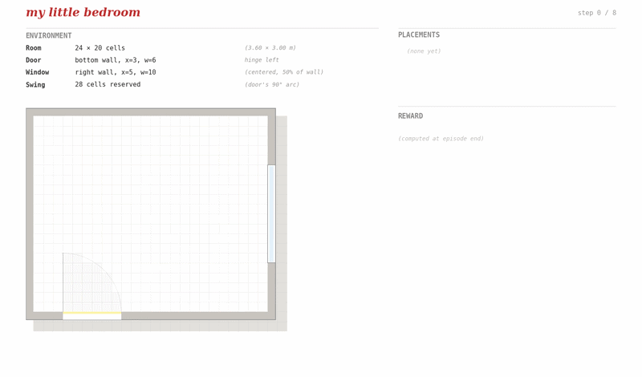
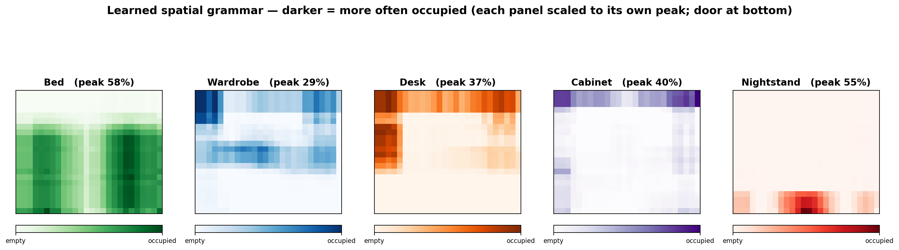
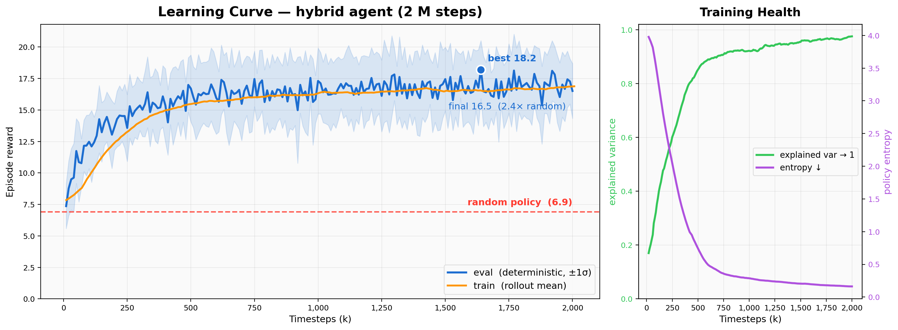
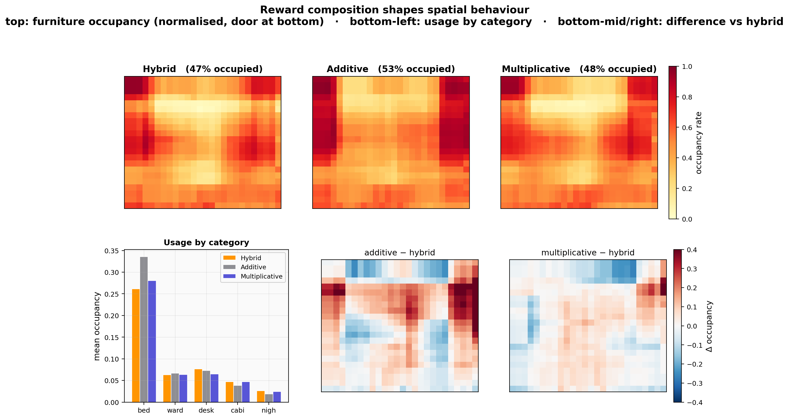
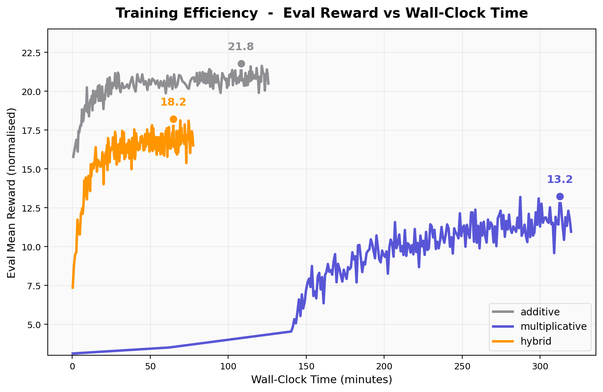

# 🏠 My Little Bedroom

[](https://huggingface.co/spaces/Huch64/myLittleBedroom)

> A **reinforcement-learning agent that furnishes bedrooms** — placing the bed, desk, wardrobe and nightstand so the room is livable: easy to move through, bed kept private from the door, window left unblocked, floor space well used. We never tell it *how* to arrange anything; we only score the finished room. The twist we found along the way: *how you compose the reward* — summing terms vs. multiplying them — is itself a design language.

<p align="center">
  
</p>

<p align="center"><i>The trained agent furnishing a brand-new random room. Nothing is hard-coded to sit against a wall or clear of the window — keeping the bed private from the door, the window unblocked, and the floor walkable are all habits learned from the reward alone.</i></p>

<p align="center">
  <b>👉 <a href="https://huggingface.co/spaces/Huch64/myLittleBedroom">Try it live</a></b> — design a room (size, door, window), then let the trained agent furnish it.
</p>

---

## What is this?

Furnishing a room is an everyday problem with no single right answer — you trade off function, comfort, and efficiency at once. We cast it as a game a reinforcement-learning agent can play:

Each episode starts with an **empty, procedurally generated room** — random shape, door and window — plus a catalog of furniture (18 pieces across 5 categories). One piece at a time, the agent chooses *what* to place, *where*, and *which way it faces* — one move out of **~41,000** each step. When it declares the room done, the layout earns a **single scalar reward** combining six terms: usable furniture, privacy, daylight, floor reachability, variety, and tidiness.

No instructions, no demonstrations, no example layouts — just that reward, and a fresh room every episode so it can't memorize. The question: can it pick up genuine interior-design sense on its own?

It can. 👇

---

## What the agent learned

Across hundreds of unseen rooms, we mapped *where* the agent places each furniture type. Each one converged on its own spot — matching the common-sense rules a person would use, none of which were ever specified:



- 🛏 **Bed** → tucked against the side walls (keeps the floor open, hides it from the door)
- 👔 **Wardrobe / Desk** → back wall and corners
- 🛋 **Nightstand** → fills leftover gaps in a consistent spot, not scattered at random

Because the room changes every episode, the only way to do this is by *reading the room's geometry* — the policy is positional, not memorized.

---

## Does it work?

Yes. The trained agent scores **2.4× better than a random policy** (16.5 vs. 6.9) and learns steadily without collapse. Crucially, the evaluation curve on **held-out rooms** tracks the training curve — so the policy is **generalizing across random rooms, not memorizing** them:



<sub>Final run: MaskablePPO, 2M steps, 20 parallel rooms, ~78 min on CPU. Most of the gain lands in the first ~750K steps.</sub>

---

## The core finding: reward composition as a design language

While tuning the reward, one result stood out: **hold the six terms fixed, and the way you combine them still changes everything the agent does.** We trained the same agent under three reward formulations:

| Recipe | Formula | What the agent does |
|---|---|---|
| **Additive** | `A + 5p + 5l + 5e + div + comp` | **Games it.** Crams in furniture to farm area points, blocks the window, leaves the bed exposed to the door. High score, unlivable room. |
| **Multiplicative** | `A · p · l · e · div · comp` | **Too strict.** Any single weak term zeroes the whole score, so early mistakes give no gradient — training stalls for the first ~140 min. |
| **Hybrid** *(ours)* | `A · p · l · e + div + comp` | **Balanced.** The `×` part sets non-negotiable quality floors; the `+` part adds bonuses freely. Converges in ~76 min and places the most furniture. |

The principle: **`×` acts as a gate** — any weak factor drags the whole score down, making every term a must-have — while **`+` acts as negotiation**, letting a strong dimension offset a weak one. Choosing between them isn't a technical detail; it's a design decision about *what kind of room you want*.

The clearest evidence is in the rooms themselves — the same six terms, combined three ways, produce visibly different layouts:

<p align="center">
  <br>
  <i>Same ingredients, different recipe → different room. The difference maps (bottom) show where additive and multiplicative diverge from the hybrid baseline.</i>
</p>

And the formulation doesn't only change <i>what</i> the agent does — it changes how fast it can learn at all:

<p align="center">
  <br>
  <i>Hybrid converges in ~76 min; multiplicative stalls for the first ~140 min before any signal breaks through.</i>
</p>

---

## Quick Start

```bash
# 1. create env + install deps (Python 3.10+ recommended)
python -m venv .venv && source .venv/bin/activate
pip install -r requirements.txt

# 2. smoke-test the env (~5 s)
python sanity_check.py

# 3. spot-check that env reward matches the HTML preview (~5 s)
python verify.py                # prints HTML setup steps + env's A/D/W

# 4. record a random-agent baseline video
python render.py --episodes 2 --seed 0 --save videos/random.mp4

# 5. train the agent (default 500K steps, ~25–40 min on CPU)
python train.py

# 6. record the trained agent on the SAME seeds as random
python render.py --episodes 5 --seed 0 \
    --model runs/<run_name>/best/best_model.zip \
    --save videos/trained.mp4
```

Watch the training curves live:
```bash
tensorboard --logdir runs/
```

---

## How it works

- **The game (MDP)**: state = the room grid + everything placed so far (state space ≈ 10¹¹–10¹², far past anything tabular). Action = `(piece × cell × orientation)` plus `DONE` → **41,185** discrete actions. Bed must go first; max 8 steps.
- **Algorithm**: MaskablePPO (`sb3-contrib`) — PPO with **action masking**, so the agent only ever considers *legal* placements (thousands early, single digits as the room fills). Hard constraints live in the mask; soft preferences live in the reward — which keeps the learning signal clean.
- **Network** (~483K params): the room (a `26×22` grid × 3 channels + 5 "placed" flags = 1721-dim) passes through a small MLP, then a **factored policy head** predicts piece / x / y / orientation / done separately and combines them — instead of one giant 41,185-way output layer.
- **Reward**: `R = Availability × privacy × light × efficiency + diversity + compactness`, with one hard rule — **no bed, no reward** (a bedroom needs a bed). Full details in [`my_little_bedroom_spec.md`](my_little_bedroom_spec.md); an interactive version runs in the browser: [`my_little_bedroom.html`](my_little_bedroom.html).

---

## What's next

- **Hand-tuned constants.** The reward weights and floors were set by hand (guided by `reward_audit.py`, below) — learning or auto-tuning them is open.
- **The grid is flat.** Spatial relations like "facing", "adjacent to", "blocking" are only implicit. A **graph-based representation** (cf. *House-GAN++*, Nauata et al. 2021) could make them explicit as edges — bridging reward-driven RL with relation-driven layout generation.

---

## What's in the repo

| File | What it does |
|---|---|
| 🎮 `my_little_bedroom.html` | Interactive preview — the visual + reward reference |
| 📄 `my_little_bedroom_spec.md` | Full rules: states, actions, reward |
| 🏗️ `env.py` | The bedroom environment (Gymnasium), action mask, rendering |
| 🧪 `sanity_check.py` | Quick smoke tests |
| ✅ `verify.py` | Cross-checks the reward against the HTML preview |
| 🔬 `reward_audit.py` | Profiles the reward landscape *before* training |
| 🚂 `train.py` | Trains the agent + logging + best-model saving |
| 🎬 `render.py` | Records the agent playing to an mp4 |
| 📈 `plot_training.py` | Makes the training-curve figures |
| 🧮 `evaluate.py` | Scores trained agents on a common yardstick |
| 🕸️ `plot_radar.py` | The behavior radar chart |
| 📓 `analysis_plots.ipynb` | All the analysis figures in one place |
| 🔁 `collect_*.py` | Data collectors that feed the notebook |

Generated while running (not committed): `runs/` (training logs + saved models) and `videos/` (recorded playthroughs).

---

## A bit more detail

**Per-run logs** land in `runs/<run_name>/`:

| File | What's in it |
|---|---|
| `config.json` | Hyperparameters + start time |
| `progress.csv` | Training internals: reward, losses, KL, lr, entropy, … |
| `episodes.csv` | One row per episode: scores, room config, items placed |
| `evaluations.npz` | Eval rewards over time |
| `events.out.tfevents.*` | TensorBoard events |
| `final.zip`, `best/best_model.zip` | Saved policies |

**Reward audit** — we profile the scoring function in seconds *before* committing to a multi-hour run, to catch traps early. A healthy reward looks like:

```bash
python reward_audit.py --n 2000 --save plots/audit.png
```
- score distribution is smooth, not clumped at one value
- doing nothing scores *worse* than actually playing
- no single factor dominates the others
- no sudden cliffs as the room fills up

**If training stalls:** `--ent-coef 0.05` encourages more exploration when the agent places too few items.
